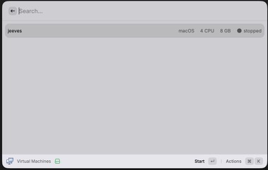

# Lume

Manage [Lume](https://github.com/trycua/cua) virtual machines on Apple Silicon directly from Raycast.

## Features

- List all VMs with their OS, CPU, memory, and running status
- Start and stop VMs with optimistic UI updates
- Delete VMs with a confirmation prompt

## Requirements

- macOS on Apple Silicon
- [Lume](https://github.com/trycua/cua) installed (`brew tap trycua/lume && brew install lume`)
- Lume HTTP server running (`lume serve`)

## Usage

Open Raycast and search for **Virtual Machines**. The extension will guide you if Lume is not installed or the server is not running.

## Credits

Icon: [virtual-machine-3](https://opensvg.dev) by Streamline, licensed under [CC BY 4.0](https://creativecommons.org/licenses/by/4.0/).
